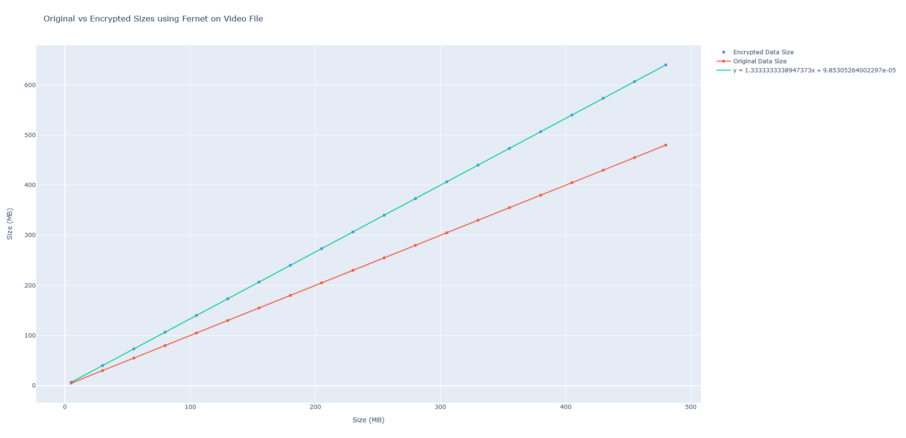

# Encrypt Size Problem
- encryption makes your data larger
- so when targeting a file size, we have to shoot for a smaller size to encrypt
- i.e. if max size is 400 MB, then we have to use 350 MB of the original so when the data is encrypted it increases to below 400 MB (just random numbers)
- so i wanted to find a definitive way of scaling back for this particular encryption library

- started with 5 MB and scaled up by 25 MB, up to 500 MB
- then ran the encryption on each test case
- afterwards measured the size and ran linear regression
- finally plot

- results?
- linear factor of 1.333
- in code we just rounded to 1.35 cause why not

